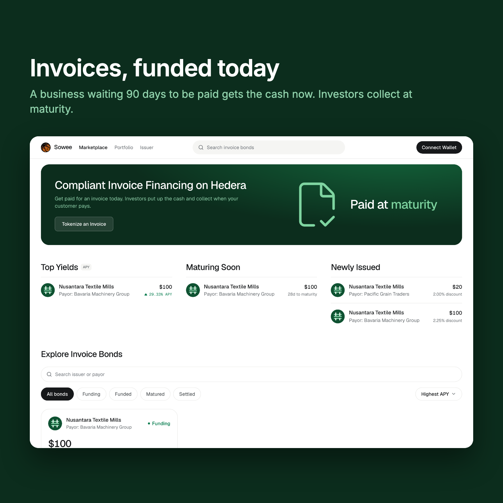
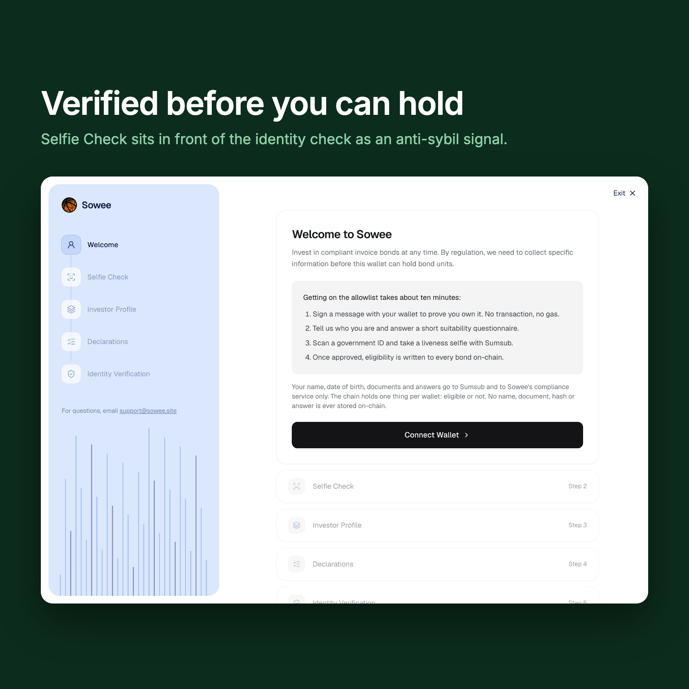
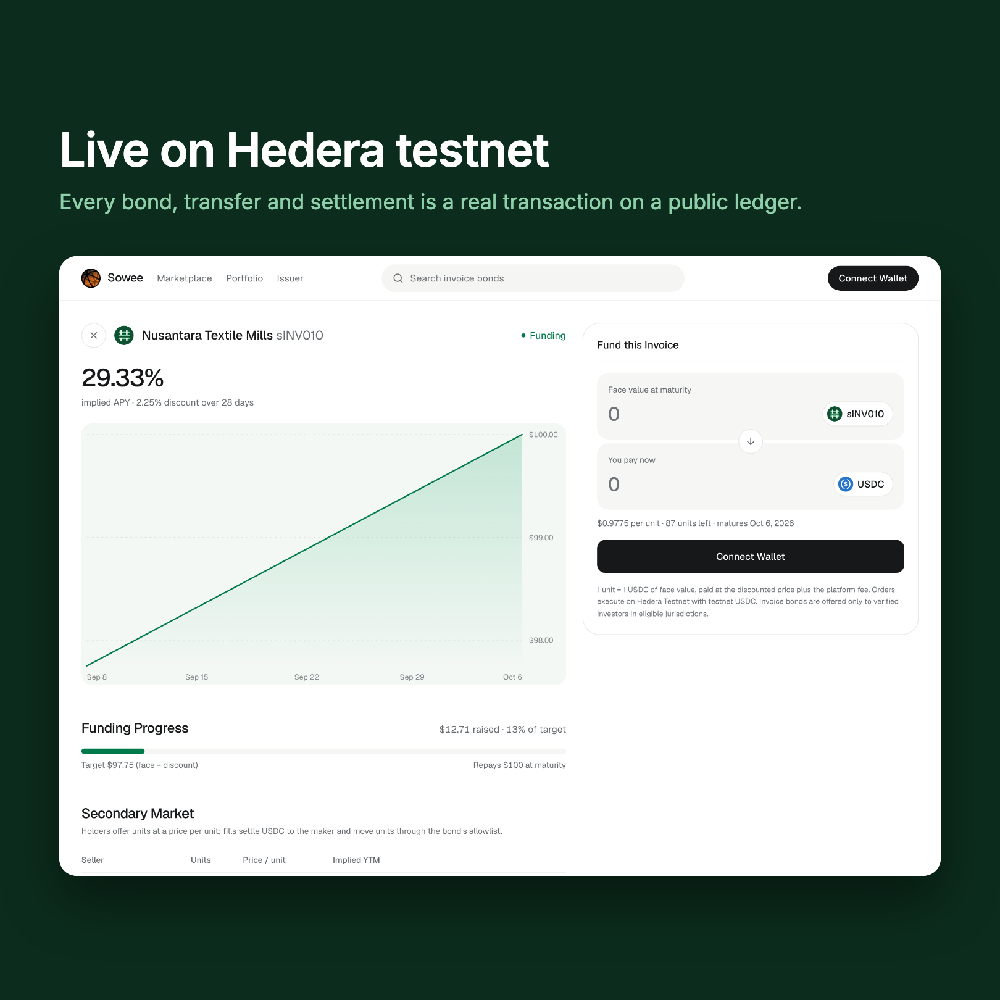

<p align="center">
  
</p>

<h3 align="center">Get paid for an invoice today.<br>Investors put up the cash and collect when your customer pays.</h3>

<p align="center">
  <a href="https://app.sowee.site"><b>app.sowee.site</b></a> ·
  <a href="https://api.sowee.site/openapi.json">API</a> ·
  <a href="https://hashscan.io/testnet/topic/0.0.10388277">audit trail</a>
</p>

---



A small business finishes a job, sends the invoice, then waits 30 to 90 days for the money.
Sowee turns that invoice into a bond an investor can fund now: the business gets most of the
cash today, the investor collects the full amount when the customer pays.



The rules are enforced by the token, not by us. Every transfer checks an allowlist inside the
bond, so a wallet that has not passed identity, liveness and a suitability questionnaire cannot
hold a unit — not in the primary sale, not on the secondary market. US persons are excluded
under Regulation S, sanctioned jurisdictions blocked, PEPs held for review. Only the yes-or-no
decision goes on chain: no names, no documents, not even a hash of one.

World's Selfie Check sits in front of that heavier check as an anti-sybil signal.



Everything above runs on Hedera testnet with real transactions. There is no database and no file
store anywhere in it: issuance, the sha256 of the invoice document and x402 payment receipts are
anchored to a Consensus Service topic, and the index that stops one document being pledged twice
is rebuilt by replaying that topic at startup.

## Live

| | |
|---|---|
| DiscountOracle | [`0xb6d7F1…9010`](https://hashscan.io/testnet/contract/0xb6d7F1e018195E0000eb0EE017E36c61113e9010) |
| InvoiceMarket | [`0xe7f896…5962`](https://hashscan.io/testnet/contract/0xe7f89692940f5BCc30096cd48f360F2144155962) |
| MaturitySettlement | [`0x68faa9…6219`](https://hashscan.io/testnet/contract/0x68faa98A8e42ef8ffC946e3d571C3940Dc0f6219) |
| Regulated security through **Asset Tokenization Studio** (`Reg S`, ISIN `XSHUZWMQSU19`) | [`0xb438390f…e078`](https://hashscan.io/testnet/contract/0xb438390fE710b12d1951E3b250889A673356e078) |
| HCS audit topic | [`0.0.10388277`](https://hashscan.io/testnet/topic/0.0.10388277) |
| An agent paying for market data over x402 | [`0.0.7162784@1788720477…`](https://hashscan.io/testnet/transaction/0.0.7162784-1788720477-579246898) |
| …then funding the bond it chose | [`0x89d2462b…`](https://hashscan.io/testnet/transaction/0x89d2462bb54ca04f90437e02de567e998f84abc2698571732db18f7148f0e8ec) |
| Full lifecycle: list → grant → fund → ask → fill → repay → settle → claim | [ten transactions](contracts/README.md#live-lifecycle-testnet-transactions) |

Every contract we deploy is exact-match verified on Sourcify, on Hedera testnet and on Arc
testnet — including each bond token, which the market deploys rather than the script. The same
finance core runs on **Arc**, Circle's USDC-native L1, funded in native USDC.

## Repository

| Path | Contents |
|---|---|
| [`contracts/`](contracts/) | Foundry: bond token, oracle, market, settlement. 50 tests |
| [`apps/api/`](apps/api/) | Go: quotes, HCS, x402 gate, KYC, Selfie Check, faucet |
| [`apps/web/`](apps/web/) | Next.js: marketplace, bond page, issuer flow, portfolio, KYC wizard |
| [`apps/agent/`](apps/agent/) | x402: discover → pay → read → fund |
| [`apps/ats/`](apps/ats/) | issuing an invoice as a regulated security through ATS |
| [`apps/landing/`](apps/landing/) | the page at `sowee.site`, showing a live listing read from the market |
| [`docs/`](docs/) | plan, partner notes, deploy, video runbook |

## Run it

Needs bun, Go 1.25 and Foundry.

```sh
git clone --recurse-submodules https://github.com/sowee-finance/sowee && cd sowee
bun install
```

Against Hedera testnet, copy [`.env.demo.example`](.env.demo.example) to `.env.demo`, fill in the
keys it documents, then:

```sh
scripts/demo.sh up       # builds and starts the API and the web app, prints the links
scripts/demo.sh status   # what is listening, and the live contract and topic
scripts/demo.sh down
```

Each vendor is optional on its own: without Sumsub the KYC routes answer 503 and everything else
still runs. For a purely local chain, and for the KYC sandbox walkthrough, see
[`docs/running.md`](docs/running.md).

Tests: `forge test`, `go test ./...` in `apps/api`, `bun test` in `apps/web` and `apps/agent`.

## About this build

Built from scratch for [ETHOnline 2026](https://ethglobal.com/events/ethonline2026), 4–13
September 2026. No code here predates the hacking window; see the commit history, the issues and
pull requests, and [`AI-USAGE.md`](AI-USAGE.md). The visual design follows Sowee's existing brand;
the implementation is new.

Partner tracks: **Hedera** · **World** · **Arc**. Notes in [`docs/partners/`](docs/partners/),
including World's required [developer feedback](docs/partners/world-feedback.md). Plan and
milestones: [`docs/plan.md`](docs/plan.md).
