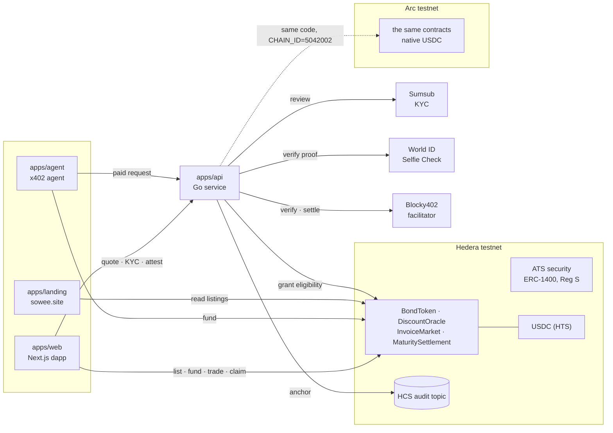
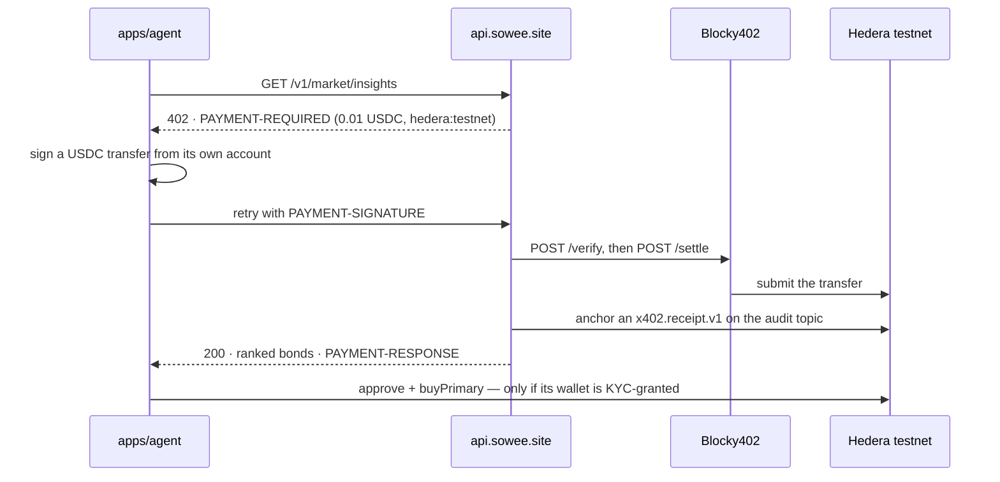
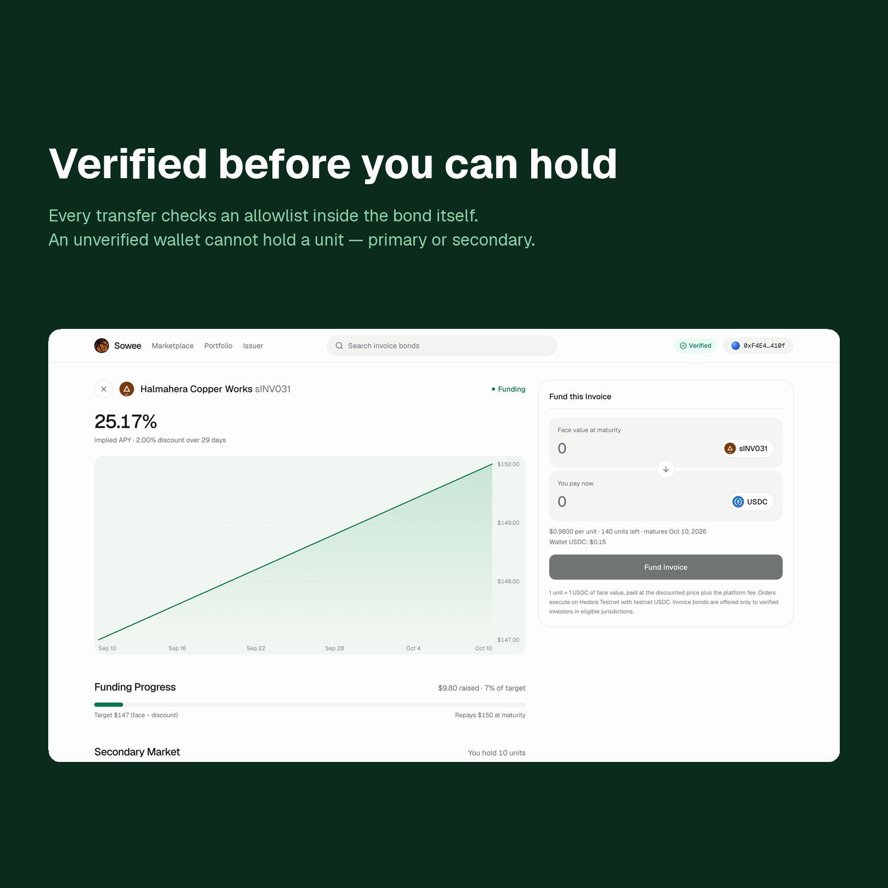
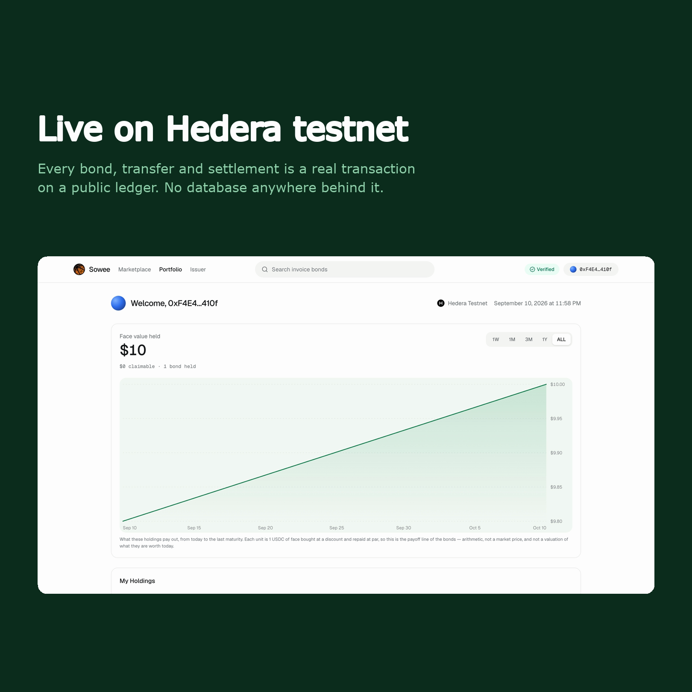

<p align="center">
  
</p>

<h3 align="center">Get paid for an invoice today.<br>Investors put up the cash and collect when your customer pays.</h3>

<p align="center">
  <a href="https://app.sowee.site"><b>Live app</b></a> ·
  <a href="https://sowee.site">Website</a> ·
  <a href="https://api.sowee.site/openapi.json">API</a> ·
  <a href="https://hashscan.io/testnet/topic/0.0.10388277">Audit trail</a>
</p>


## What it is

A business finishes a job, sends the invoice, and waits 30 to 90 days to be paid. Sowee turns
that invoice into a bond that investors fund today in USDC. The business gets the cash now; the
investors collect the full amount when the customer pays.

Only verified investors can hold a bond. The rule lives inside the token, so it holds on every
transfer — the first sale and every trade after it.

## How it works

1. **Issue.** The business submits an invoice. The document is hashed in the browser; only its
   sha256 ever leaves the device.
2. **Price.** The API signs an EIP-712 discount quote. The oracle accepts each quote exactly once.
3. **List.** One transaction deploys the bond and opens funding. The issuance is anchored to a
   Hedera Consensus Service topic.
4. **Verify.** An investor passes a World Selfie Check, then Sumsub KYC and a suitability
   questionnaire. US persons are blocked under Regulation S; politically exposed persons are held
   for review. Only the yes-or-no decision goes on chain — no names, no documents.
5. **Fund.** Eligible wallets buy units in USDC, which goes straight to the issuer.
6. **Settle.** At maturity the payor repays and holders claim their share. Claiming burns the
   units, so nobody can claim twice.

Agents can buy too. An agent pays for market data over x402, reads it, and funds the bond it
picks — but only if its wallet passed the same KYC a person does.

There is no database anywhere in the system. Issuance, document hashes, payment receipts and
Selfie Check results are all written to one public Hedera topic, and the API rebuilds its state by
replaying it.

## Architecture



- **`apps/web`** is where people act: issue, fund, trade, claim, and the KYC wizard. Every write is
  a transaction from the user's own wallet.
- **`apps/api`** holds the keys a browser must not: it signs discount quotes, writes the audit topic,
  runs KYC and the eligibility grant, verifies Selfie Check proofs, and gates the paid market data.
  It keeps no database — it rebuilds its state by replaying the topic at startup.
- **The contracts** enforce the rules. The allowlist lives in the bond token, so no front end and no
  API can move a unit to a wallet that has not passed KYC.
- **`apps/ats`** issues an invoice as a regulated security through Hedera's Asset Tokenization
  Studio, and **`apps/agent`** is a buyer that pays for data before it acts.

## The x402 payment flow



The price and the rail are discovered from the `402` itself, not configured in the agent. The
endpoint describes itself at [`/openapi.json`](https://api.sowee.site/openapi.json). Run the agent
with `bun run src/index.ts --dry` to stop before paying, or `--execute 1` to fund one unit of the
bond it picks — see [`apps/agent`](apps/agent/).



## Partner integrations

| Partner | What we used, and where | Tracks | Feedback |
|---|---|---|---|
| **Hedera** | HTS for USDC and token association · HCS as the audit trail · EVM contracts · mirror node · **Asset Tokenization Studio** to issue an invoice as an ERC-1400 security with an ISIN and Reg S (`apps/ats`) · an **x402** paid API settled through Blocky402, and an agent that pays for it (`apps/api`, `apps/agent`) | Tokenization of Anything · AI & Agentic Payments | [hedera.md](docs/partners/hedera.md#feedback-honest-specific) |
| **Arc** | the same contracts on Arc, where USDC is both the gas and the settlement asset (native USDC, the Circle faucet): an invoice listed with an API-signed quote, the same KYC decision granted, a bond funded in native USDC, an ask on the secondary market | Best DeFi / Onchain Finance Application | [arc.md](docs/partners/arc.md#feedback) |
| **World** | **Selfie Check** through IDKit 4.2 as an anti-sybil step before KYC (`apps/web`); the RP signature is made server-side and the proof verified there (`apps/api`) | Selfie Check | [world-feedback.md](docs/partners/world-feedback.md) |

Integration notes for each partner are in [`docs/partners/`](docs/partners/).



## Live on testnet

| | |
|---|---|
| InvoiceMarket (Hedera) | [`0xe7f896…5962`](https://hashscan.io/testnet/contract/0xe7f89692940f5BCc30096cd48f360F2144155962) |
| DiscountOracle (Hedera) | [`0xb6d7F1…9010`](https://hashscan.io/testnet/contract/0xb6d7F1e018195E0000eb0EE017E36c61113e9010) |
| MaturitySettlement (Hedera) | [`0x68faa9…6219`](https://hashscan.io/testnet/contract/0x68faa98A8e42ef8ffC946e3d571C3940Dc0f6219) |
| ATS security — ISIN `XSHUZWMQSU19`, Reg S | [`0xb43839…e078`](https://hashscan.io/testnet/contract/0xb438390fE710b12d1951E3b250889A673356e078) |
| Audit topic | [`0.0.10388277`](https://hashscan.io/testnet/topic/0.0.10388277) |
| An agent paying over x402 · then funding a bond | [payment](https://hashscan.io/testnet/transaction/0.0.7162784-1788720477-579246898) · [funding](https://hashscan.io/testnet/transaction/0x89d2462bb54ca04f90437e02de567e998f84abc2698571732db18f7148f0e8ec) |
| InvoiceMarket (Arc) | [`0x830bAB…1937`](https://testnet.arcscan.app/address/0x830bAB679B1AD09c5eD0Eb3a53614cbC1DC51937) |
| A full bond lifecycle, list to claim | [ten transactions](contracts/README.md#live-lifecycle-testnet-transactions) |

Our contracts, including every bond token the market deploys, are verified through Sourcify, so
HashScan and Arcscan show their source. The ATS security is Hedera's own contract. Every claim above can be checked with one command, which exits
non-zero if any of it stops being true:

```sh
bun run scripts/verify-claims.ts
```

## Built during ETHOnline 2026

**What is new.** All of the project's own code was written during the hacking window, 4–13
September 2026. The history shows it: each change is an issue, a branch, small commits and a pull
request — [see the pull requests](https://github.com/sowee-finance/sowee/pulls?q=is%3Apr+is%3Amerged).

**What is reused.** Nothing below is code from an earlier project.

| Reused | From | Where it appears |
|---|---|---|
| Visual design — logo, colours and page layout | Sowee's existing brand, which predates the hackathon. The look was re-implemented in new code; no code was copied | `apps/web` |
| Landing layout, two hero images and one transition clip | *Infinite — Premium Credit Card*, a third-party web template the team chose; not the team's own work | `apps/landing/public/` |
| Open-source libraries | OpenZeppelin, Next.js, viem, wagmi, the Hiero SDK, chi, and others — see each `package.json` and `go.mod` | throughout |
| Partner tools and infrastructure | Hedera ATS contracts, testnet USDC, the Blocky402 facilitator, World IDKit, the Sumsub WebSDK | as integrated above |

## How AI was used

The team wrote the plan — product scope, system design, compliance policy and a task list with
acceptance criteria — then built it with **Claude Code**, task by task, reviewing every change
before it was merged. Architecture, product and compliance decisions are the team's.

- [`AI-USAGE.md`](AI-USAGE.md) — file by file: which parts were AI-assisted, what the AI produced,
  and how the team reviewed it
- [`docs/ai/prompts.md`](docs/ai/prompts.md) — the prompts the team gave the assistant
- [`docs/plan.md`](docs/plan.md) — the plan the work was driven from

## Run it

Needs bun, Go 1.25 and Foundry.

```sh
git clone --recurse-submodules https://github.com/sowee-finance/sowee && cd sowee
bun install
cp .env.demo.example .env.demo    # fill in the keys it lists
scripts/demo.sh up                # starts the API and the web app against Hedera testnet
```

Each vendor is optional: without Sumsub keys the KYC routes answer 503 and the rest still runs.
For a local chain and the KYC sandbox walkthrough, see [`docs/running.md`](docs/running.md).

Tests: `forge test` in `contracts`, `go test ./...` in `apps/api`, `bun test` in `apps/web` and
`apps/agent`.

## Repository

| Path | Contents |
|---|---|
| [`contracts/`](contracts/) | Solidity (Foundry): bond token, discount oracle, market, settlement |
| [`apps/api/`](apps/api/) | Go: quote signing, audit topic, x402 paid API, KYC, Selfie Check |
| [`apps/web/`](apps/web/) | Next.js: marketplace, bond page, issuer console, portfolio, KYC wizard |
| [`apps/agent/`](apps/agent/) | an x402 agent: discover, pay, read, fund |
| [`apps/ats/`](apps/ats/) | issuing an invoice as a regulated security through ATS |
| [`apps/landing/`](apps/landing/) | the website at `sowee.site` |
| [`docs/`](docs/) | plan, partner notes and feedback, deployment, demo runbook |
