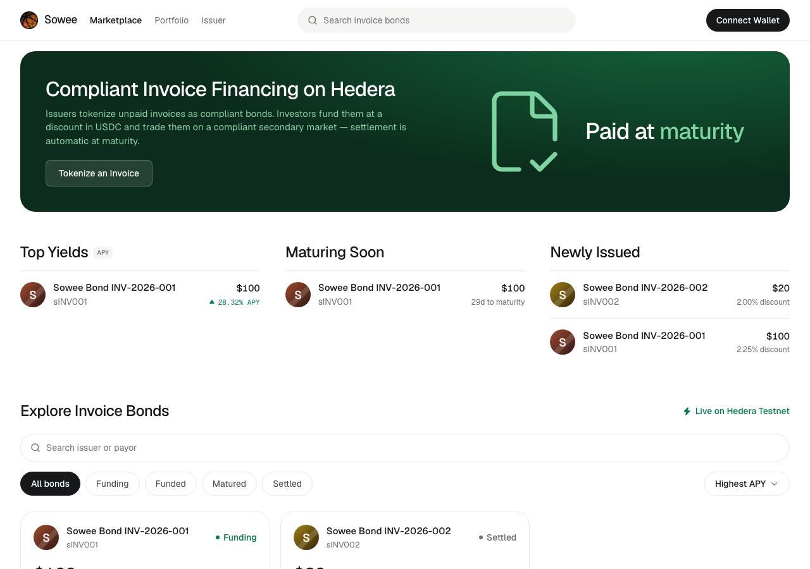
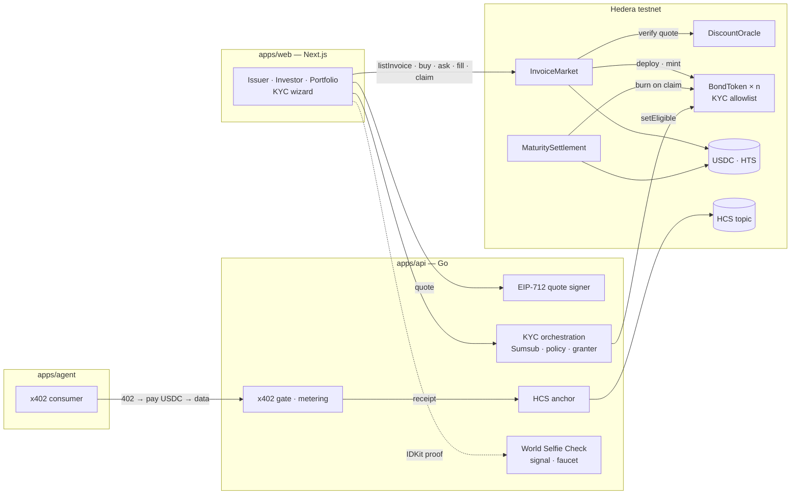
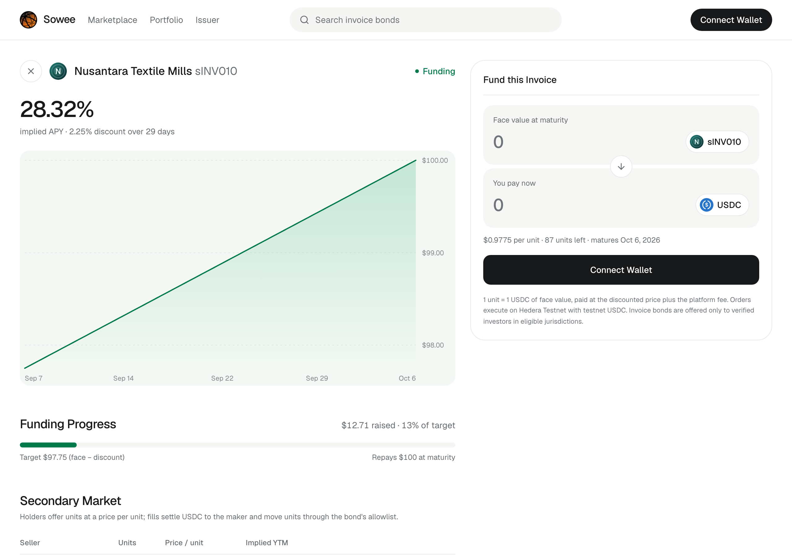

# Sowee

**Compliant invoice financing on Hedera.** An unpaid invoice becomes a KYC-gated, fractional
bond token: priced by a signed discount quote, funded in USDC, tradable on a compliant secondary
market, settled pro-rata at maturity — with the audit trail anchored to Hedera Consensus
Service and a pay-per-call market-data API that autonomous agents pay for over x402.

Built from scratch for [ETHOnline 2026](https://ethglobal.com/events/ethonline2026), 4–13
September 2026. No code here predates the hacking window; see the commit history, the issues
and pull requests, and [`AI-USAGE.md`](AI-USAGE.md). The web app's visual design and brand
assets follow Sowee's existing brand; the implementation is new.

Partner tracks: **Hedera** (Tokenization of Anything · AI & Agentic Payments) · **World**
(Selfie Check) · **Arc** (stretch). Partner notes: [`docs/partners/`](docs/partners/).

## Live on Hedera testnet

| What | Where |
|---|---|
| DiscountOracle | [`0xb6d7F1…9010`](https://hashscan.io/testnet/contract/0xb6d7F1e018195E0000eb0EE017E36c61113e9010) |
| InvoiceMarket | [`0xe7f896…5962`](https://hashscan.io/testnet/contract/0xe7f89692940f5BCc30096cd48f360F2144155962) |
| MaturitySettlement | [`0x68faa9…6219`](https://hashscan.io/testnet/contract/0x68faa98A8e42ef8ffC946e3d571C3940Dc0f6219) |
| Bond `sINV010` (100 USDC, 2.25%, 30 days) | [`0xCb4056…9E8c`](https://hashscan.io/testnet/contract/0xCb4056Da92692877d5587eD51f63a5A410F39E8c) |
| HCS audit topic | [`0.0.10388277`](https://hashscan.io/testnet/topic/0.0.10388277) |
| x402 payment settled for an agent | [`0.0.7162784@1788720477.579246898`](https://hashscan.io/testnet/transaction/0.0.7162784-1788720477-579246898) |
| The agent funding the bond it paid to find | [`0x89d2462b…`](https://hashscan.io/testnet/transaction/0x89d2462bb54ca04f90437e02de567e998f84abc2698571732db18f7148f0e8ec) |
| Full lifecycle: list → KYC grant → fund → ask → fill → repay → settle → claim | [ten transactions](contracts/README.md#live-lifecycle-testnet-transactions) |

All contract sources are exact-match verified on Sourcify. The same bytecode also runs on
**Arc testnet** with a bond funded in native USDC — see [`contracts/README.md`](contracts/README.md#arc-testnet-chain-5042002).



## How it works



**Lifecycle.** The issuer submits an invoice; the document is hashed in the browser and only the
sha256 is anchored. The API prices it (2% + 0.25% per 30 days of tenor) and signs an EIP-712
quote; `InvoiceMarket.listInvoice` verifies the quote on-chain (signer, expiry, nonce burned)
and deploys a `BondToken` for the invoice. Investors fund units in USDC at the discounted price
(USDC goes straight to the issuer), trade them on an allowance-based secondary market, and after
maturity surrender units for a pro-rata share of what the payor repaid. Every transfer — mint,
primary, secondary — is checked against the bond's KYC allowlist inside `_update`, so a fill to
a wallet that was never granted reverts at the token layer.

**Compliance.** A wallet signs a challenge, completes Sumsub (document + liveness) and a
suitability questionnaire; the API runs a fail-closed policy (US person → blocked under
Regulation S; sanctioned jurisdictions → blocked; PEP → held) and, on *eligible*, writes
`setEligible` on every live bond. Only the decision reaches the chain — no name, document or
hash. World Selfie Check sits in front as an anti-sybil signal that unlocks the demo faucet and
a larger API allowance; it is a signal, not a substitute for KYC.



**Agentic payments.** `GET /v1/market/insights` is x402-gated: 0.01 USDC per call on
`hedera:testnet`, verified and settled by the Blocky402 facilitator. `apps/agent` discovers the
price from the 402, pays with its own Hedera account (the facilitator sponsors that fee), consumes
the ranked bond list — and with `--execute` funds the bond it chose, from the same wallet, subject
to the same KYC allowlist a human faces. The API anchors a receipt on HCS and meters the payer.

## Repository

| Path | Contents |
|---|---|
| [`contracts/`](contracts/) | Foundry: `BondToken`, `DiscountOracle`, `InvoiceMarket`, `MaturitySettlement`, `HederaAssociable`; 42 tests; two-stage Hedera deploy |
| [`apps/api/`](apps/api/) | Go: quotes, HCS, x402 + metering, KYC (Sumsub, policy, granter), World Selfie Check, faucet, rate limits |
| [`apps/web/`](apps/web/) | Next.js: marketplace, bond detail with secondary market, issuer flow, portfolio + claims, KYC wizard |
| [`apps/agent/`](apps/agent/) | bun script: x402 discover → pay → consume |
| [`docs/`](docs/) | build plan, partner notes |

## Run it

Prerequisites: bun, Go 1.25, Foundry.

```sh
git clone --recurse-submodules https://github.com/sowee-finance/sowee && cd sowee
bun install

# 1. contracts on a local chain
anvil &                                    # prints account 0's key
cd contracts && DEPLOYER_PK=<anvil key 0> QUOTE_SIGNER=<anvil address 0> WRITE_DEPLOYMENTS=true \
  forge script script/Deploy.s.sol --rpc-url http://127.0.0.1:8545 --broadcast && cd ..

# 2. api (quotes work without any vendor credential)
cd apps/api && PORT=8080 CHAIN_ID=31337 DISCOUNT_ORACLE=<from contracts/deployments/31337.json> \
  QUOTE_SIGNER_PK=<anvil key 0> go run ./cmd/api & cd ../..

# 3. web
cd apps/web && NEXT_PUBLIC_CHAIN_ID=31337 bun run dev
```

Against Hedera testnet, set `NEXT_PUBLIC_CHAIN_ID=296` (addresses come from
`contracts/deployments/296.json`) and give the API the environment in
[`apps/api/.env.example`](apps/api/.env.example): Hedera operator (HCS), Sumsub sandbox pair
(KYC), `INVOICE_MARKET` (insights + granter), optional `WORLD_*` (Selfie Check).

Tests: `forge test` in `contracts/`, `go test ./...` in `apps/api`, `bun test` in
`apps/web` and `apps/agent`. CI runs Biome, Foundry and Go on every pull request.

## Try KYC yourself

The Sumsub **sandbox** never checks real documents. Open the wizard (`/kyc`), sign the
challenge, fill the profile and declarations, then in the identity step upload any of Sumsub's
[sandbox test documents](https://docs.sumsub.com/docs/sandbox-testing) — a sample passport
image plus the liveness selfie in your browser. The review comes back in a minute; the wizard
polls `GET /v1/kyc/status` and shows `held`, `blocked` (answer "US person: yes" to see Reg S
in action) or `granted` with the on-chain transactions. Without a webcam, a sandbox review can
be simulated with Sumsub's `status/testCompleted` endpoint — that is how the live grant in the
table above was produced.

## Design choices

- **Plain-EVM compliance token** we fully control, tested in-process, portable to Arc unchanged.
- **USDC never sits in the market**: issuer and makers are paid directly; only settlement escrows.
- **Pull-based claims that burn**: no loops, no double claims, no gas cliffs.
- **Status only on-chain**, fail-closed off-chain.
- **Receipts and attestations on HCS**, replayed from the mirror node on start — no database.

Full plan and milestone map: [`docs/plan.md`](docs/plan.md). Demo video: added at submission.
