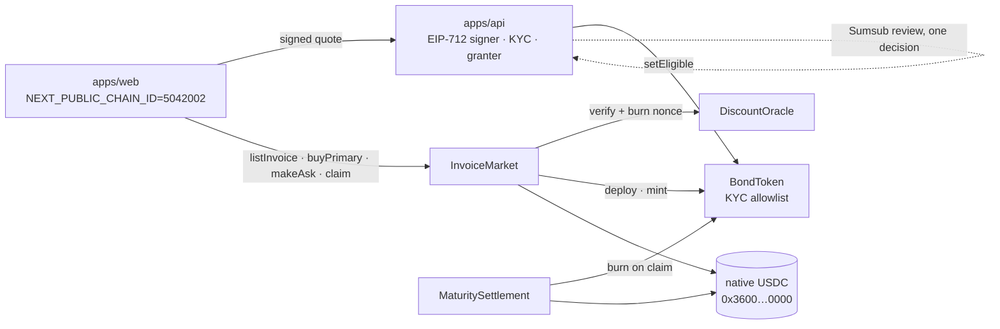

# Arc (Circle) — integration notes and feedback

Tracks: **Best DeFi / Onchain Finance** and **Launch on Arc Testnet & Push to Mainnet**.

## Verified facts we build on

| Item | Value |
|---|---|
| Chain id | 5042002 (testnet) — checked with `cast chain-id` |
| RPC | `https://rpc.testnet.arc.network` |
| USDC | `0x3600000000000000000000000000000000000000` — ERC-20 interface, `symbol() = USDC`, `decimals() = 6`; USDC is also the native gas token (18-decimal native units) |
| Faucet | `https://faucet.circle.com` (select Arc Testnet) |
| Explorer | `https://testnet.arcscan.app` |

## Plan

The finance core is plain EVM: `BondToken`, `DiscountOracle`, `InvoiceMarket`,
`MaturitySettlement` deploy unchanged (`HederaAssociable` is a no-op off Hedera). The only Arc
specifics are the USDC address and gas paid in USDC. Deploy script: `--rpc-url arc_testnet`.

## Architecture on Arc

The same API process prices and grants on either chain: the EIP-712 domain binds `chainId` and
the oracle address, so pointing `CHAIN_ID`, `RPC_URL`, `DISCOUNT_ORACLE` and `INVOICE_MARKET` at
Arc is the whole configuration. A wallet that passed KYC once is granted on both chains from the
same Sumsub decision.

## Status — live on Arc testnet

| Contract | Address |
|---|---|
| DiscountOracle | https://testnet.arcscan.app/address/0x4bB1A6c2C352795A3Dff74D5D234711a40bA5a78 |
| InvoiceMarket | https://testnet.arcscan.app/address/0x830bAB679B1AD09c5eD0Eb3a53614cbC1DC51937 |
| MaturitySettlement | https://testnet.arcscan.app/address/0x68D7D788Ac36A3e019680B8D503e468FE7235F0b |
| Bond `sARC001` (50 USDC, 2.25%, 45 days) | https://testnet.arcscan.app/address/0x86478cB59EDab4E899BeC5D0637fe0771D68574E |

| Step | Transaction |
|---|---|
| `listInvoice` ARC-2026-001 with an API-signed quote | https://testnet.arcscan.app/tx/0x65e2d561668edbf805b4c2f007b9815da532bb4beeeabd27087759bb1e3b14ae |
| KYC grant written by the compliance operator, from the same Sumsub review used on Hedera | https://testnet.arcscan.app/tx/0xd1775e78dffd0b56d576b8501ac19d8aa0bdf8112cdd9b792aac1c520c59a339 |
| `buyPrimary` 5 units funded in **native USDC** | https://testnet.arcscan.app/tx/0x74fb1a57a1f65d82919de12d71dfaa6ccc9085060b8cee995defaac5117e59b7 |
| `makeAsk` 2 units at 99% of face on the compliant secondary market | https://testnet.arcscan.app/tx/0x3a6c0bf346e6b52fa45e833a2d62ecff2307977e4573e64932e5f2b176444706 |

An earlier Arc deployment carried the pre-review contracts; it was replaced rather than patched,
so the addresses above are the only ones the repo and the app point at.

The deploy and the whole lifecycle used exactly the Hedera bytecode: `HederaAssociable` is a
no-op off Hedera, and the market/settlement only ever call the ERC-20 interface. The API signs
Arc quotes by pointing `CHAIN_ID=5042002` and `DISCOUNT_ORACLE` at the Arc oracle (EIP-712
domain binds chain and contract), so one service can price both chains.

## Circle developer tools used

- **Native USDC on Arc** as gas and as the settlement asset, through the ERC-20 interface at
  `0x3600…0000` (6 decimals for the interface, 18 for the native balance).
- **Circle faucet** (`faucet.circle.com`) for testnet USDC.
- Sources verified through Sourcify (Arc testnet is supported); Arcscan links above.

The frontend is the same app: `apps/web` carries an Arc chain entry, reads
`contracts/deployments/5042002.json`, and renders the Arc marketplace, bond page and portfolio
with Arcscan links. HCS anchoring and the x402 endpoint stay on Hedera; nothing about the Arc
finance core depends on them.

### Mainnet

The same bytecode is what would go to Arc mainnet: only `USDC` and the RPC change, and
`HederaAssociable` is already a no-op off Hedera. `script/Deploy.s.sol` takes the mainnet USDC
address through `USDC` and the roles through `COMPLIANCE_OPERATOR` and `TREASURY`, so the
deployment is a configuration change, not a code change.

## Feedback

- Gas in USDC with 18-decimal native units next to a 6-decimal ERC-20 view of the same
  balance is easy to trip over in tooling that assumes one decimals value per asset.
- Foundry, cast and Sourcify worked out of the box on chain 5042002 — the smoothest of the
  three networks in this build.
- A transfer shows two `Transfer` logs (one from the native precompile at `0xff…fe`, one from
  `0x3600…`), which double-counts in naive indexers.
